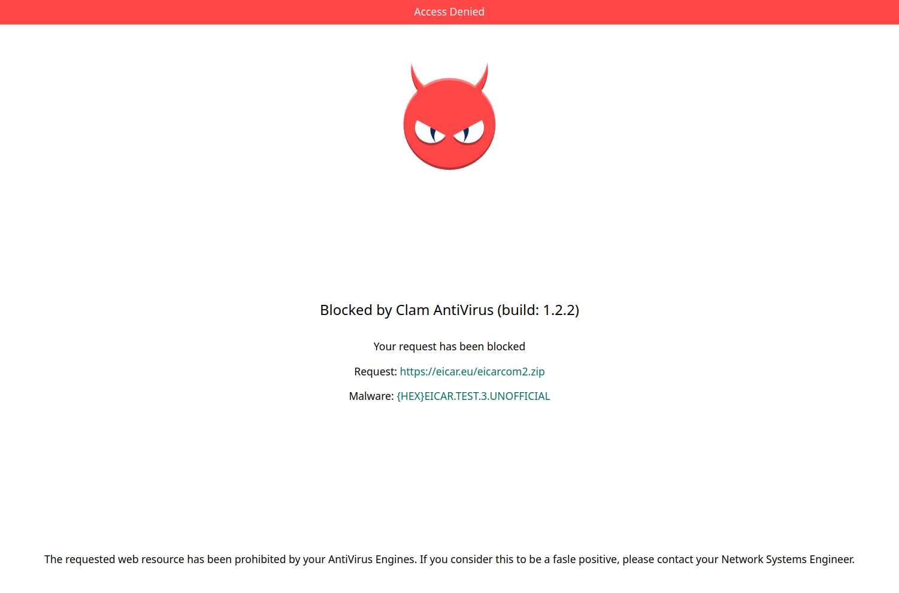

# LXC_cICAP_ClamAV

## Building an ICAP enabled AntiVirus Server based on c-icap, ClamAV and Alpine Linux on Proxmox PVE/LXC container.

The idea here is to create an LXC Alpine based container that will host:
- [c-icap server](https://github.com/c-icap/c-icap-server) as our HTTP proxy ICAP content adaptation and filtering services.
- [ClamAV](https://github.com/Cisco-Talos/clamav) as our backend AntiVirus scanning system upon ICAP submissions.
- [SquidClamAV](https://github.com/darold/squidclamav) compiled & enabled as an ICAP service.
- The [ClamAV official signatures databases](https://lists.clamav.net/pipermail/clamav-virusdb/).
- 3rd party unoffical ClamAV sginatures databases enhancing our defenses.

## Targeted physical environment --> you'll need two NIC's on your LXC container:
````
 - eth0 should be bound/connected to unfiltered WAN (a WAN/DMZ LAN/VLAN)
 - eth1 should be bound/connected to where you'd like to engage/connect through ICAP on TCP:1344 (your Proxy LAN/VLAN or such)

         +-----------------------------------------------------+                                                     
         |  cICAP Alpine LXC                                   |                                                     
         |                                                     |                                                     
         |                                     +-------------+ |                                                     
         |                                     | ClamAV      | |                                                     
         |                                     | ClamD       | |                                                     
         | +-------------+                     +-------------+ |                                                     
         | | freshclam   |                     | c-icap      | |                                                     
         | | signatures  |                     |             | |                                                     
         | | updates     |                     |             | |                                                     
         | +-------------+                     +-------------+ |                                                     
         |-----------------------------------------------------|                                                     
 eth0/WAN| ||| |                                         | ||| |eth1/LAN                                            
         +-----+                                         +-----+tcp:1344                                                     
           |                                                |                                                        
           |                                                |                                                        
       0.0.0.0/0                                       Proxy / ICAP Client
                                                       10/8
                                                       172.16/12
                                                       192.168/16  
````

This implementation has been influenced by this repository [c_icapClamav](https://github.com/nkapashi/c_icapClamav) which is held toward Docker environements. I do not "dislike" Docker at all, although as I'm running PVE in my personal setups, I find PVE + LXC very handy and convenient in terms of updates, backups and so on. Docker in my own setups pretty much always means two or more layers of virtualization, which I tend to avoid if not puerly for demo's etc.

A few notes before you start:
- You might use Squid as your main proxy server -- mind that the Squid ICAP integration/implementation is beyond our scope here. You'll find more information about this [here](https://wiki.squid-cache.org/ConfigExamples/ContentAdaptation/C-ICAP).
- Obviously, you can submit to ICAP what you can read & see, therefore [SSL Bumping/SSL intercpetion](https://wiki.squid-cache.org/Features/SslBump) might be advised on your proxy subsystem in order to "intercept" SSL/TLS encrypted streams.
- The ```ConcurrentDatabaseReload yes``` parameter which is set within ```/etc/clamav/clamd.conf``` will require you to have enough free system resources (2x operational used memory, 4GB shall be enough) in order to temporarily load a second ClamAV scanning engine while scanning continues using the first engine. Once fully loaded, the new engine takes over while the previous goes to heaven.
- You're able to address either SquidClamAV service [OR] the srv_clamav c-icap service, can be useful for testings etc.
- [VIRUS_FOUND](https://github.com/obuno/LXC_cICAP_ClamAV/blob/main/opt/c-icap/share/c_icap/templates/virus_scan/en-US/VIRUS_FOUND) replacement HTML page has been customized in order to provide a somewhat better looking block page in the occurence of offending bits found by ClamAV (see below).


You can use the included [cicap-deploy.sh](https://github.com/obuno/LXC_cICAP_ClamAV/blob/main/cicap-deploy.sh) shell script to deploy/compile everything needed at once.

## Proxmox PVE container creation:
### Download/Get the latest Alpine LXC template
````
    pveam update
    pveam available | grep alpine
    pveam download local alpine-3.19-default_20240207_amd64.tar.xz
````
### Create your PVE LXC container -- A typical PVE LXC container PVE cli that would suite our needs: (mind the container ID, admin password, vlan tags, IPs etc.. adapt to your environment):
````
    pct create 100 local:vztmpl/alpine-3.19-default_20240207_amd64.tar.xz \
    --storage local-lvm --ostype alpine \
    --arch amd64 --password ChangeMe --unprivileged 1 \
    --cores 4 --memory 4096 --swap 4096 \
    --hostname cICAP --rootfs volume=local-lvm:16 \
    --nameserver 9.9.9.9 --searchdomain local.lan \
    --net0 name=eth0,bridge=vmbr99,tag=99,ip=192.168.1.134/24,gw=192.168.1.254,type=veth \
    --net1 name=eth1,bridge=vmbr1,tag=1,ip=10.1.1.134/24,gw=10.1.1.254,type=veth \
    --start false

    pct start 100
````
## From within a console on our newly created/booted Alpine LXC Container:

### Install the needed components:

The provided [cicap-deploy.sh](https://github.com/obuno/LXC_cICAP_ClamAV/blob/main/cicap-deploy.sh) script will do everything in one shot -- You need to gather its content and run the shell script.
Create & boot your container, get the script contents in a local file and run it.
````
    cICAP:/# mkdir -p /tmp/install && cd /tmp/install
    cICAP:/tmp/install# wget https://raw.githubusercontent.com/obuno/LXC_cICAP_ClamAV/main/cicap-deploy.sh
    cICAP:/tmp/install# sh cicap-deploy.sh
````

## Verfying our setup
### Confirming our ClamAV databases are stored locally:
````
cICAP:~# ls -lsah /var/lib/clamav/
total 373M   
   4.0K drwxr-xr-x    2 clamav   clamav      4.0K Feb 18 16:08 .
   4.0K drwxr-xr-x    7 root     root        4.0K Feb 18 16:02 ..
   4.0K -rw-r--r--    1 clamav   clamav      1.4K Feb 18 16:08 Sanesecurity_sigtest.yara
   4.0K -rw-r--r--    1 clamav   clamav      1.2K Feb 18 16:08 Sanesecurity_spam.yara
 108.0K -rw-r--r--    1 clamav   clamav    107.4K Feb 18 16:08 badmacro.ndb
 312.0K -rw-r--r--    1 clamav   clamav    308.2K Feb 18 16:08 blurl.ndb
   4.0K -rw-r--r--    1 clamav   clamav      3.4K Feb 18 16:08 bofhland_cracked_URL.ndb
   4.0K -rw-r--r--    1 clamav   clamav       610 Feb 18 16:08 bofhland_malware_URL.ndb
 104.0K -rw-r--r--    1 clamav   clamav    103.8K Feb 18 16:08 bofhland_malware_attach.hdb
  12.0K -rw-r--r--    1 clamav   clamav      9.4K Feb 18 16:08 bofhland_phishing_URL.ndb
 288.0K -rw-r--r--    1 clamav   clamav    285.1K Feb 18 16:08 bytecode.cvd
  76.0K -rw-r--r--    1 clamav   clamav     72.5K Feb 18 16:08 clamav.ldb
   4.0K -rw-r--r--    1 clamav   clamav        82 Feb 18 16:08 crdfam.clamav.hdb
 190.2M -rw-r--r--    1 clamav   clamav    190.2M Feb 18 16:07 daily.cld
   4.0K -rw-r--r--    1 clamav   clamav        69 Feb 18 16:07 freshclam.dat
  48.0K -rw-r--r--    1 clamav   clamav     47.0K Feb 18 16:08 hackingteam.hsb
   8.0K -rw-r--r--    1 clamav   clamav      5.8K Feb 18 16:08 indicator_rmm.ldb
   6.8M -rw-r--r--    1 clamav   clamav      6.8M Feb 18 16:08 junk.ndb
   3.3M -rw-r--r--    1 clamav   clamav      3.3M Feb 18 16:08 jurlbl.ndb
  88.0K -rw-r--r--    1 clamav   clamav     86.4K Feb 18 16:08 jurlbla.ndb
 240.0K -rw-r--r--    1 clamav   clamav    239.9K Feb 18 16:08 lott.ndb
 162.6M -rw-r--r--    1 clamav   clamav    162.6M Feb 18 16:07 main.cvd
 100.0K -rw-r--r--    1 clamav   clamav     98.5K Feb 18 16:08 malwarehash.hsb
   4.3M -rw-r--r--    1 clamav   clamav      4.3M Feb 18 16:08 phish.ndb
   4.0K -rw-r--r--    1 clamav   clamav       107 Feb 18 16:08 phishtank.ndb
  24.0K -rw-r--r--    1 clamav   clamav     21.8K Feb 18 16:08 porcupine.hsb
 172.0K -rw-r--r--    1 clamav   clamav    168.9K Feb 18 16:08 porcupine.ndb
 856.0K -rw-r--r--    1 clamav   clamav    852.6K Feb 18 16:08 rfxn.hdb
 444.0K -rw-r--r--    1 clamav   clamav    443.4K Feb 18 16:08 rfxn.ndb
 704.0K -rw-r--r--    1 clamav   clamav    700.4K Feb 18 16:08 rogue.hdb
  16.0K -rw-r--r--    1 clamav   clamav     12.2K Feb 18 16:08 sanesecurity.ftm
   1.9M -rw-r--r--    1 clamav   clamav      1.9M Feb 18 16:08 scam.ndb
  12.0K -rw-r--r--    1 clamav   clamav      9.3K Feb 18 16:08 shelter.ldb
   4.0K -rw-r--r--    1 clamav   clamav       488 Feb 18 16:08 sigwhitelist.ign2
   4.0K -rw-r--r--    1 clamav   clamav       115 Feb 18 16:08 spear.ndb
   4.0K -rw-r--r--    1 clamav   clamav       115 Feb 18 16:08 spearl.ndb
   4.0K -rw-r--r--    1 clamav   clamav        64 Feb 18 16:08 winnow.attachments.hdb
   4.0K -rw-r--r--    1 clamav   clamav       660 Feb 18 16:08 winnow.complex.patterns.ldb
   4.0K -rw-r--r--    1 clamav   clamav        66 Feb 18 16:08 winnow_bad_cw.hdb
   4.0K -rw-r--r--    1 clamav   clamav        65 Feb 18 16:08 winnow_extended_malware.hdb
   4.0K -rw-r--r--    1 clamav   clamav       159 Feb 18 16:08 winnow_extended_malware_links.ndb
   4.0K -rw-r--r--    1 clamav   clamav        65 Feb 18 16:08 winnow_malware.hdb
  16.0K -rw-r--r--    1 clamav   clamav     14.4K Feb 18 16:08 winnow_malware_links.ndb
   8.0K -rw-r--r--    1 clamav   clamav      6.4K Feb 18 16:08 winnow_phish_complete_url.ndb
   4.0K -rw-r--r--    1 clamav   clamav      2.7K Feb 18 16:08 winnow_spam_complete.ndb
````

### Listing the ClamAV loaded databases:
````
cICAP:~# clamscan --debug 2>&1 /dev/null | grep "loaded"
LibClamAV debug: unrar support loaded from /usr/lib/libclamunrar_iface.so.12.0.1
LibClamAV debug: /var/lib/clamav/sigwhitelist.ign2 loaded
LibClamAV debug: /var/lib/clamav/securiteinfo.ign2 loaded
LibClamAV debug: daily.info loaded
...
````

### Confirm our process are up and running:
````
cICAP:~#
cICAP:~# ps
PID   USER     TIME  COMMAND
 ...
 458 clamav    0:36 /usr/sbin/clamd
 465 root      0:00 /opt/c-icap/bin/c-icap -D -d 5
 468 root      0:00 /opt/c-icap/bin/c-icap -D -d 5
 470 root      0:00 /opt/c-icap/bin/c-icap -D -d 5
 477 root      0:00 /opt/c-icap/bin/c-icap -D -d 5
 ...

cICAP:~# rc-status
Runlevel: default
 ...
 c-clamd                [  started  ]
 c-icap                 [  started  ]
 ... 

cICAP:~#
cICAP:~# ss -tnlp
State                     Recv-Q                    Send-Q                  Local Address:Port              Peer Address:Port                
LISTEN                    0                         512                     10.0.0.1:1344                   0.0.0.0:*
cICAP:~#
cICAP:~#
````

### Confirming our c-icap server is operating correctly (assuming your Proxy <--> c-icap integration is functional):
````
cICAP:~# tail -f /opt/c-icap/var/log/server.log
 TransferPreview: "Transfer-Preview: *"
 TransferIgnore: 
 TransferComplete: 
 Max-Connections: -1
Wed Apr 10 06:16:13 2024, 763/134926734121784, squidclamav.c(331) squidclamav_release_request_data: Wed Apr 10 06:16:13 2024, 763/134926734121784, DEBUG Releasing request data.
Wed Apr 10 06:16:13 2024, 763/134926734121784, connection closed or request timed-out or request interrupted....
Wed Apr 10 06:16:13 2024, 763/134926734981944, connection closed or request timed-out or request interrupted....
Wed Apr 10 06:16:19 2024, 769/134926734695224, connection closed or request timed-out or request interrupted....
Wed Apr 10 06:16:19 2024, 769/134926734981944, connection closed or request timed-out or request interrupted....
Wed Apr 10 06:16:19 2024, 769/134926734981944, Max requests reached, reallocate memory and buffers .....
Wed Apr 10 06:16:47 2024, 763/134926734838584, squidclamav.c(304) squidclamav_init_request_data: Wed Apr 10 06:16:47 2024, 763/134926734838584, DEBUG initializing request data handler.
Wed Apr 10 06:16:47 2024, 763/134926734838584, squidclamav.c(359) squidclamav_check_preview_handler: Wed Apr 10 06:16:47 2024, 763/134926734838584, DEBUG processing preview header.
Wed Apr 10 06:16:47 2024, 763/134926734838584, squidclamav.c(391) squidclamav_check_preview_handler: Wed Apr 10 06:16:47 2024, 763/134926734838584, DEBUG X-Client-IP: 10.0.0.2
Wed Apr 10 06:16:47 2024, 763/134926734838584, squidclamav.c(1784) extract_http_info: Wed Apr 10 06:16:47 2024, 763/134926734838584, DEBUG method CONNECT
Wed Apr 10 06:16:47 2024, 763/134926734838584, squidclamav.c(1795) extract_http_info: Wed Apr 10 06:16:47 2024, 763/134926734838584, DEBUG url templeos.org:443
...
````

### Checking the "freshclam" hourly updates status:

````
cICAP:~# run-parts --test /etc/periodic/hourly
/etc/periodic/hourly/freshclam


cICAP:~# cat /var/log/clamav/freshclam-hourly.log
--------------------------------------
ClamAV update process started at Sun Feb 18 17:00:00 2024
daily.cld database is up-to-date (version: 27189, sigs: 2053641, f-level: 90, builder: raynman)
main.cvd database is up-to-date (version: 62, sigs: 6647427, f-level: 90, builder: sigmgr)
bytecode.cvd database is up-to-date (version: 334, sigs: 91, f-level: 90, builder: anvilleg)
...
````

## Listing the running c-icap server statistics

````
cICAP:~# c-icap-client -s "info?table=*?view=text" -i [your-icap-bound-ip] -p 1344 -req use-any-url
ICAP server:[your-icap-bound-ip], ip:[your-icap-bound-ip], port:1344

Running Servers Statistics
===========================
Children number: 3
Free Servers: 27
Used Servers: 3
Started Processes: 6
Closed Processes: 3
Crashed Processes: 0
...
````

## Recommended ClamAV add-ons:

I would highly recommend you to add/test the following unofficial ClamAV databases to your locally available ClamAV DB's:

- The ClamAV database files available on this repository: https://github.com/ditekshen/detection (already included in the provided configuration)
- The SecuriteInfo ClamAV databases in "Pro Subscription": https://www.securiteinfo.com/clamav-antivirus/improve-detection-rate-of-zero-day-malwares-for-clamav.shtml?lg=en

## Testing your setup:

You can test your setup using a few available Malware Test sites on the internet:


https://eicar.eu   
https://sophostest.com   
https://www.amtso.org/security-features-check/   
https://www.ikarussecurity.com/wp-content/downloads/eicar_com.zip   
https://www.virusanalyst.com/eicar.zip   


## Troubleshooting:

### General troubleshooting information:

- the container ready to serve time can take up to 2/3 minutes, all the ClamAV databases are loaded in memory at boot time -- just be patient.
- you're able to restart both involved services using:   
   ```rc-service c-icap restart```   
   ```rc-service c-clamd restart```
- should you think that some signatures might trigger on false positive, you're able to [whitelist them](https://www.securiteinfo.com/clamav-antivirus/whitelisting-clamav-signatures.shtml).
- For SquidClamAV, the ICAP client should have these properties set accordingly: IP of your container | Service port = TCP:1344 | Service Name = squidclamav | Type = REQMOD or RESPMOD
- For srv_clamav, the ICAP client should have these properties set accordingly: IP of your container | Service port = TCP:1344 | Service Name = srv_clamav | Type = REQMOD or RESPMOD

### implementation specifics:

- the ```squidclamav.conf``` file include a few 'exclusions' I find appopriate. Perhaps you do not. You can of course edit this file and comment lines in the block after line #88
- Installed packages (gcc, g++, make, etc.) are NOT removed. While I'd agree that some of them could/can be removed for security purposes, in my setups, I do not see the need for that. I keep these cICAP appliances off anything else than ICAP_TCP:1344 within the same network segment as any ICAP clients. Should you enable network remote access (ssh etc), please consider the risks of leaving all these packages installed.

## To Do/To Fix:

[*] update/fix the c-icap service definition (fails to stop/restart on the first attempt) -- FIXED 10/04/2024
