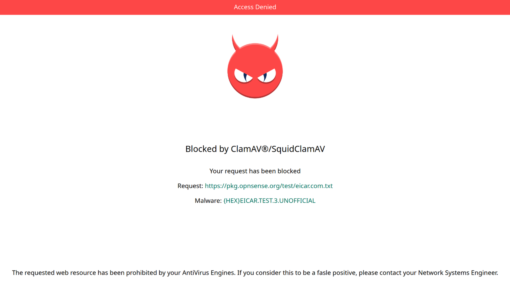

# LXC_cICAP_ClamAV

## Building an ICAP enabled AntiVirus Server based on c-icap, ClamAV and Alpine Linux on Proxmox PVE/LXC container.

The idea of this project is to create an Alpine based LXC container that will host:
- [c-icap server](https://github.com/c-icap/c-icap-server) as our HTTP proxy ICAP content adaptation and filtering services.
- [SquidClamAV](https://github.com/darold/squidclamav) compiled & enabled as an ICAP service.
- [ClamAV](https://github.com/Cisco-Talos/clamav) as our backend AntiVirus scanning system upon ICAP submissions.
- The [ClamAV official signatures databases](https://lists.clamav.net/pipermail/clamav-virusdb/).
- 3rd party unofficial ClamAV signatures databases enhancing our defenses.

Basically, the ideal Proxy Server's companion thus offloading all the on-the-fly AntiVirus tasks through ICAP.

## Targeted physical environment --> you'll need two NIC's on your LXC container:
````
 - eth0 should be bound/connected to unfiltered WAN (a WAN/DMZ LAN/VLAN)
 - eth1 should be bound/connected to where you'd like to engage/connect through ICAP on TCP:1345 (your Proxy LAN/VLAN or such)

         +-----------------------------------------------------+                                                     
         |  cICAP Alpine LXC                                   |                                                     
         |                                                     |                                                     
         |                                     +-------------+ |                                                     
         |                                     | ClamAV      | |                                                     
         |                                     | ClamD       | |                                                     
         | +-------------+                     +-------------+ |                                                     
         | | freshclam   |                     | c-icap      | |                                                     
         | | signatures  |                     |             | |                                                     
         | | updates     |                     |             | |                                                     
         | +-------------+                     +-------------+ |                                                     
         |-----------------------------------------------------|                                                     
 eth0/WAN| ||| |                                         | ||| |eth1/LAN                                            
         +-----+                                         +-----+tcp:1345                                                 
           |                                                |                                                        
           |                                                |                                                        
       0.0.0.0/0                                       Proxy / ICAP Client
                                                       10/8
                                                       172.16/12
                                                       192.168/16  
````

This implementation has been influenced by this repository [c_icapClamav](https://github.com/nkapashi/c_icapClamav) which is held toward Docker environments. I do not "dislike" Docker at all, although as I'm running PVE in my personal setups, I find PVE + LXC very handy and convenient in terms of updates, backups and so on. Docker in my own setups pretty much always means two or more layers of virtualization, which I tend to avoid if not purely for demo's etc.

A few notes before you start:
- You might use Squid as your main proxy server -- mind that the Squid ICAP integration/implementation is beyond our scope here. You'll find more information about this [here](https://wiki.squid-cache.org/ConfigExamples/ContentAdaptation/C-ICAP).
- Obviously, you can submit to ICAP what you can read & see, therefore [SSL Bumping/SSL interception](https://wiki.squid-cache.org/Features/SslBump) might be advised on your proxy subsystem in order to "intercept" SSL/TLS encrypted streams.
- The ```ConcurrentDatabaseReload yes``` parameter which is set within [```/etc/clamav/clamd.conf```](https://github.com/obuno/LXC_cICAP_ClamAV/blob/main/etc/clamav/clamd.conf) will require you to have enough free system resources (2x operational used memory, 4GB shall be enough) in order to temporarily load a second ClamAV scanning engine while scanning continues using the first engine. Once fully loaded, the new engine takes over while the previous goes to heaven.
- [```MALWARE_FOUND```](https://github.com/obuno/LXC_cICAP_ClamAV/blob/main/opt/c-icap/share/c_icap/templates/squidclamav/en-US/MALWARE_FOUND) replacement HTML page has been customized in order to provide a somewhat better looking block page in the occurrence of offending bits found by ClamAV (see below).


You can use the included [cicap-deploy.sh](https://github.com/obuno/LXC_cICAP_ClamAV/blob/main/cicap-deploy.sh) shell script to deploy/compile everything needed at once.

## 1: Proxmox PVE container creation:
### Download/Get the latest Alpine LXC template on Proxmox
````
pveam update
pveam available | grep alpine
pveam download local alpine-3.21-default_20241217_amd64.tar.xz
````
### Create your PVE LXC container -- A typical PVE LXC container PVE cli that would suite our needs: (mind the container ID, admin password, bound bridges, vlan tags, IPs etc.. adapt to your environment):
````
pct create 100 local:vztmpl/alpine-3.21-default_20241217_amd64.tar.xz \
--storage local-lvm \
--ostype alpine \
--arch amd64 \
--password ChangeMe \
--unprivileged 1 \
--cores 8 \
--memory 8192 \
--swap 8192 \
--hostname cICAP \
--rootfs volume=local-lvm:16 \
--nameserver 9.9.9.9 \
--searchdomain local.lan \
--features nesting=1 \
--net0 name=eth0,bridge=vmbr1,tag=100,ip=192.168.13.45/24,gw=192.168.1.254,type=veth \
--net1 name=eth1,bridge=vmbr9,tag=999,ip=10.1.13.45/24,type=veth \
--start false

pct start 100
````
## 2: Install the needed components on your newly created/booted Alpine LXC Container:

There are two options using the deployment script provided:

- Deploy Alpine Linux distribution using the ```/main/``` repository
- Deploy Alpine Linux distribution using the ```/edge/``` repository

The main differences are the apk packages retrieved, the ```/main/``` repository currently host [ClamAV 1.2.2-r0](https://pkgs.alpinelinux.org/packages?name=clamav&branch=v3.20&repo=&arch=&maintainer=) while the ```/edge/``` host the [ClamAV 1.4.1-r0](https://pkgs.alpinelinux.org/packages?name=clamav&branch=edge&repo=&arch=&maintainer=) package.

The provided script will do everything in one shot -- You need to create & boot your container (see above) and get the script contents in a local file and run it (see below). 
Open a root shell on your freshly created LXC container and run:

```
mkdir -p /tmp/install && cd /tmp/install
wget https://raw.githubusercontent.com/obuno/LXC_cICAP_ClamAV/main/cicap-deploy.sh
sh cicap-deploy.sh
```

I.E. running the deployment script and opting for the ```/edge/``` Alpine repository:

````
; ####################################################
; ###### cICAP deployment START ######################
; ####################################################

; ####################################################
; ###### cICAP system status CHECK ###################
; ####################################################
[*] Your system host multiple NICs, is this correct? (Y/n) y
; ####################################################
; ###### apk update & add ############################
; ####################################################
[*] Do you want to use the Alpine Edge Repository? (Y/n) y  --> Answering NO here will get you /latest-stable/ Alpine setup.
...
````

## 3: Verifying our setup
### Confirming our ClamAV databases are stored locally:
````
cICAP:~# ls -lsah /var/lib/clamav/
total 373M   
   4.0K drwxr-xr-x    2 clamav   clamav      4.0K Feb 18 16:08 .
   4.0K drwxr-xr-x    7 root     root        4.0K Feb 18 16:02 ..
   4.0K -rw-r--r--    1 clamav   clamav      1.4K Feb 18 16:08 Sanesecurity_sigtest.yara
   4.0K -rw-r--r--    1 clamav   clamav      1.2K Feb 18 16:08 Sanesecurity_spam.yara
 108.0K -rw-r--r--    1 clamav   clamav    107.4K Feb 18 16:08 badmacro.ndb
 312.0K -rw-r--r--    1 clamav   clamav    308.2K Feb 18 16:08 blurl.ndb
   4.0K -rw-r--r--    1 clamav   clamav      3.4K Feb 18 16:08 bofhland_cracked_URL.ndb
   4.0K -rw-r--r--    1 clamav   clamav       610 Feb 18 16:08 bofhland_malware_URL.ndb
 104.0K -rw-r--r--    1 clamav   clamav    103.8K Feb 18 16:08 bofhland_malware_attach.hdb
  12.0K -rw-r--r--    1 clamav   clamav      9.4K Feb 18 16:08 bofhland_phishing_URL.ndb
 288.0K -rw-r--r--    1 clamav   clamav    285.1K Feb 18 16:08 bytecode.cvd
  76.0K -rw-r--r--    1 clamav   clamav     72.5K Feb 18 16:08 clamav.ldb
   4.0K -rw-r--r--    1 clamav   clamav        82 Feb 18 16:08 crdfam.clamav.hdb
 190.2M -rw-r--r--    1 clamav   clamav    190.2M Feb 18 16:07 daily.cld
   4.0K -rw-r--r--    1 clamav   clamav        69 Feb 18 16:07 freshclam.dat
  48.0K -rw-r--r--    1 clamav   clamav     47.0K Feb 18 16:08 hackingteam.hsb
   8.0K -rw-r--r--    1 clamav   clamav      5.8K Feb 18 16:08 indicator_rmm.ldb
   6.8M -rw-r--r--    1 clamav   clamav      6.8M Feb 18 16:08 junk.ndb
   3.3M -rw-r--r--    1 clamav   clamav      3.3M Feb 18 16:08 jurlbl.ndb
  88.0K -rw-r--r--    1 clamav   clamav     86.4K Feb 18 16:08 jurlbla.ndb
 240.0K -rw-r--r--    1 clamav   clamav    239.9K Feb 18 16:08 lott.ndb
 162.6M -rw-r--r--    1 clamav   clamav    162.6M Feb 18 16:07 main.cvd
 100.0K -rw-r--r--    1 clamav   clamav     98.5K Feb 18 16:08 malwarehash.hsb
   4.3M -rw-r--r--    1 clamav   clamav      4.3M Feb 18 16:08 phish.ndb
   4.0K -rw-r--r--    1 clamav   clamav       107 Feb 18 16:08 phishtank.ndb
  24.0K -rw-r--r--    1 clamav   clamav     21.8K Feb 18 16:08 porcupine.hsb
 172.0K -rw-r--r--    1 clamav   clamav    168.9K Feb 18 16:08 porcupine.ndb
 856.0K -rw-r--r--    1 clamav   clamav    852.6K Feb 18 16:08 rfxn.hdb
 444.0K -rw-r--r--    1 clamav   clamav    443.4K Feb 18 16:08 rfxn.ndb
 704.0K -rw-r--r--    1 clamav   clamav    700.4K Feb 18 16:08 rogue.hdb
  16.0K -rw-r--r--    1 clamav   clamav     12.2K Feb 18 16:08 sanesecurity.ftm
   1.9M -rw-r--r--    1 clamav   clamav      1.9M Feb 18 16:08 scam.ndb
  12.0K -rw-r--r--    1 clamav   clamav      9.3K Feb 18 16:08 shelter.ldb
   4.0K -rw-r--r--    1 clamav   clamav       488 Feb 18 16:08 sigwhitelist.ign2
   4.0K -rw-r--r--    1 clamav   clamav       115 Feb 18 16:08 spear.ndb
   4.0K -rw-r--r--    1 clamav   clamav       115 Feb 18 16:08 spearl.ndb
   4.0K -rw-r--r--    1 clamav   clamav        64 Feb 18 16:08 winnow.attachments.hdb
   4.0K -rw-r--r--    1 clamav   clamav       660 Feb 18 16:08 winnow.complex.patterns.ldb
   4.0K -rw-r--r--    1 clamav   clamav        66 Feb 18 16:08 winnow_bad_cw.hdb
   4.0K -rw-r--r--    1 clamav   clamav        65 Feb 18 16:08 winnow_extended_malware.hdb
   4.0K -rw-r--r--    1 clamav   clamav       159 Feb 18 16:08 winnow_extended_malware_links.ndb
   4.0K -rw-r--r--    1 clamav   clamav        65 Feb 18 16:08 winnow_malware.hdb
  16.0K -rw-r--r--    1 clamav   clamav     14.4K Feb 18 16:08 winnow_malware_links.ndb
   8.0K -rw-r--r--    1 clamav   clamav      6.4K Feb 18 16:08 winnow_phish_complete_url.ndb
   4.0K -rw-r--r--    1 clamav   clamav      2.7K Feb 18 16:08 winnow_spam_complete.ndb
````

### Listing the ClamAV loaded databases:
````
cICAP:~# clamscan --debug 2>&1 /dev/null | grep "loaded"
LibClamAV debug: unrar support loaded from /usr/lib/libclamunrar_iface.so.12.0.2
LibClamAV debug: /var/lib/clamav/localwhitelist.ign2 loaded
LibClamAV debug: /var/lib/clamav/sigwhitelist.ign2 loaded
LibClamAV debug: daily.info loaded
LibClamAV debug: daily.cfg loaded
LibClamAV debug: daily.ndb loaded
LibClamAV debug: daily.crb loaded
LibClamAV debug: daily.ign loaded
LibClamAV debug: daily.mdb loaded
...
````

### Confirm our process are up and running:
````
cICAP:~#
cICAP:~# ps
PID   USER     TIME  COMMAND
 ...
 534 clamav    0:26 /usr/sbin/clamd
 562 cicap     0:00 /opt/c-icap/bin/c-icap -D -d 5
 564 cicap     0:00 /opt/c-icap/bin/c-icap -D -d 5
 565 cicap     0:00 /opt/c-icap/bin/c-icap -D -d 5
 571 cicap     0:00 /opt/c-icap/bin/c-icap -D -d 5
 ...

cICAP:~# rc-status
Runlevel: default
 ...
 c-clamd                [  started  ]
 c-icap                 [  started  ]
 ... 

cICAP:~#
cICAP:~# ss -utnlp
Netid        State         Recv-Q        Send-Q               Local Address:Port                Peer Address:Port        Process                                                                                                                  
tcp          LISTEN        0             512                  10.1.13.45:1345                     0.0.0.0:*            users:(("c-icap",pid=596,fd=5),("c-icap",pid=590,fd=5),("c-icap",pid=589,fd=5),("c-icap",pid=587,fd=5))                 
cICAP:~# 
cICAP:~#
````

### Confirming our c-icap server is operating correctly (assuming your Proxy <--> c-icap integration is functional):
````
cICAP:~# tail -f /var/log/c-icap/server.log
 TransferPreview: "Transfer-Preview: *"
 TransferIgnore: 
 TransferComplete: 
 Max-Connections: -1
Wed Apr 10 06:16:13 2024, 763/134926734121784, squidclamav.c(331) squidclamav_release_request_data: Wed Apr 10 06:16:13 2024, 763/134926734121784, DEBUG Releasing request data.
Wed Apr 10 06:16:13 2024, 763/134926734121784, connection closed or request timed-out or request interrupted....
Wed Apr 10 06:16:13 2024, 763/134926734981944, connection closed or request timed-out or request interrupted....
Wed Apr 10 06:16:19 2024, 769/134926734695224, connection closed or request timed-out or request interrupted....
Wed Apr 10 06:16:19 2024, 769/134926734981944, connection closed or request timed-out or request interrupted....
Wed Apr 10 06:16:19 2024, 769/134926734981944, Max requests reached, reallocate memory and buffers .....
Wed Apr 10 06:16:47 2024, 763/134926734838584, squidclamav.c(304) squidclamav_init_request_data: Wed Apr 10 06:16:47 2024, 763/134926734838584, DEBUG initializing request data handler.
Wed Apr 10 06:16:47 2024, 763/134926734838584, squidclamav.c(359) squidclamav_check_preview_handler: Wed Apr 10 06:16:47 2024, 763/134926734838584, DEBUG processing preview header.
Wed Apr 10 06:16:47 2024, 763/134926734838584, squidclamav.c(391) squidclamav_check_preview_handler: Wed Apr 10 06:16:47 2024, 763/134926734838584, DEBUG X-Client-IP: 10.0.0.2
Wed Apr 10 06:16:47 2024, 763/134926734838584, squidclamav.c(1784) extract_http_info: Wed Apr 10 06:16:47 2024, 763/134926734838584, DEBUG method CONNECT
Wed Apr 10 06:16:47 2024, 763/134926734838584, squidclamav.c(1795) extract_http_info: Wed Apr 10 06:16:47 2024, 763/134926734838584, DEBUG url templeos.org:443
...
````

### Checking the "freshclam" hourly updates status:

````
cICAP:~# run-parts --test /etc/periodic/hourly
/etc/periodic/hourly/freshclam


cICAP:~# cat /var/log/clamav/freshclam-hourly.log
--------------------------------------
ClamAV update process started at Sun Feb 18 17:00:00 2024
daily.cld database is up-to-date (version: 27189, sigs: 2053641, f-level: 90, builder: raynman)
main.cvd database is up-to-date (version: 62, sigs: 6647427, f-level: 90, builder: sigmgr)
bytecode.cvd database is up-to-date (version: 334, sigs: 91, f-level: 90, builder: anvilleg)
...
````

### Listing the running c-icap server statistics

````
cICAP:~# c-icap-client -s "info?table=*?view=text" -i [your-icap-bound-ip] -p 1345 -req use-any-url
ICAP server:[your-icap-bound-ip], ip:[your-icap-bound-ip], port:1345

Running Servers Statistics
===========================
Children number: 3
Free Servers: 27
Used Servers: 3
Started Processes: 6
Closed Processes: 3
Crashed Processes: 0
...
````

## Unofficial ClamAV provided Signatures (through freshclam):

- [SaneSecurity](https://sanesecurity.org/usage/signatures/)
- [R-fx Networks - Linux Malware Detect](https://www.rfxn.com/tag/malware/)
- [Ditekshen](https://github.com/ditekshen/detection)
- [InterServer's InterShield](http://rbl.interserver.net/)
- [URLhaus ClamAV signatures](https://urlhaus.abuse.ch/api/#clamav)

## Recommended ClamAV add-ons:

I would highly recommend you to add/test the following unofficial ClamAV databases to your locally available ClamAV DB's:

- The SecuriteInfo ClamAV databases in "Pro Subscription": https://www.securiteinfo.com/clamav-antivirus/improve-detection-rate-of-zero-day-malwares-for-clamav.shtml?lg=en

## Testing your setup:

You can test your setup using a few available Malware Test sites on the internet:

https://eicar.eu   
https://sophostest.com   
https://www.amtso.org/security-features-check/   
https://www.ikarussecurity.com/wp-content/downloads/eicar_com.zip   
https://pkg.opnsense.org/test/eicar.com.txt   
https://www.virusanalyst.com/eicar.zip   


## Updates and maintenance:

You can easily maintain you Alpine setup using the apk update/upgrade routine:

- ```apk update```
- ```apk upgrade```

However, I currently tend to simply re-deploy a new container. I'm keeping this development up-to-date usually, hence destroy/recreate is probably the most resilient approach.

## Troubleshooting:

### General troubleshooting information:

- the container ready to serve time can take up to 2/3 minutes, all the ClamAV databases are loaded in memory at boot time -- just be patient.
- you're able to restart both involved services using:   
   ```rc-service c-icap restart```   
   ```rc-service c-clamd restart```
- you should run ```icap-logs | grep FOUND``` after early deployment in order to spot presumed false positive signatures.
- you can view in real time the client IP, requested URL's and potential matching ClamAV signature using ```icap-logs | egrep "X-Client-IP|URL requested|FOUND"```
- should you think that some signatures might trigger on false positive, you're able to [whitelist them](https://www.securiteinfo.com/clamav-antivirus/whitelisting-clamav-signatures.shtml).
- for SquidClamAV, the ICAP client should have these properties set accordingly: IP of your container | Service port = TCP:1345 | Service Name = squidclamav | Type = REQMOD or RESPMOD

### Implementation specifics:

- the [```squidclamav.conf```](https://github.com/obuno/LXC_cICAP_ClamAV/blob/main/opt/c-icap/etc/squidclamav.conf) file includes a few 'exclusions' I find appropriate. Perhaps you do not. You can of course edit this file and comment lines in the block after line #88
- installed packages (gcc, g++, make, etc.) are NOT removed. While I'd agree that some of them could/can be removed for security concerns, in my setups, I do not see the need for that. I keep these cICAP appliances off anything else than ICAP_TCP:1345 within the same network segment as any ICAP clients. Should you enable network remote access (ssh etc), please consider the risks of leaving all these packages installed.

### Personal signatures whitelist:

Below you'll find which signatures I'm currently whitelisting / see Troubleshooting #3.

```
/bin/cat << 'EOF' > /var/lib/clamav/localwhitelist.ign2
Sanesecurity.Foxhole.GZip_js
SecuriteInfo.com.JS.Obfus-2420
SecuriteInfo.com.PUA.HTML.Tiktoktracker-2
SecuriteInfo.com.PUA.JS.Obfus-2552
SecuriteInfo.com.PUA.JS.Obfus-2185
SecuriteInfo_Suspicious_Phishing_Mail_6
SecuriteInfo_Suspicious_Phishing_2
SecuriteInfo.com.Spam-343
SecuriteInfo.com.Spam-6383
SecuriteInfo.com.Spam-111701
SecuriteInfo.com.Spam-114751
EOF
```

## To Do/To Fix:

- [x] the c-icap service definition fails to stop/restart on the first attempt --> 👍 10/04/2024   
- [x] the c-icap service now run's on a non root ```cicap``` system user account --> 👍 21/07/2024
- [x] the ```/var/log/c-icap/server.log``` file get's big over time -- see [```c-icap-logs-archive```](https://github.com/obuno/LXC_cICAP_ClamAV/blob/main/etc/periodic/daily/c-icap-logs-archive) --> 👍 21/07/2024
- [x] user experience improvements on the ```cicap-deploy.sh``` script --> 👍 25/11/2024
- [x] forced gcc/g++ to version ```13.2.1``` due to c-icap compilation errors with latest versions... --> 👍 09/01/2025
- [x] deployed ICAP port has been shifted from TCP:1344 to TCP:1345 --> 👍 13/01/2025